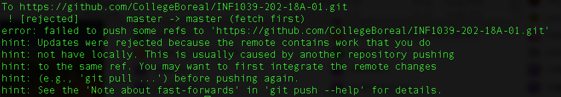

# HashTables

## :a: Operations `git bash`

* :one: Changer de répertoire vers celui du cours

```
$ cd ~/Developer/INF1039-202-18A-01
```
> :white_check_mark: S'assurer qu'on a toutes les modifications du serveur github

```
$ git pull
```

* :two: Renommer son répertoire (i.e. son :id:) en enlevant le charactere `~`

Example:

```
$ git mv 300098957~ 300098957
```

* :three: Vérifier le status (tout doit etre vert)

```
$ git status
```


* :four: Valider (commit) la modification souhaitee en y ajoutant un commentaire

```
$ git commit --message "Changement du nom de repertoire"
```

* :five: Partager mon travail 

```
$ git push
```

:x: En cas de rejet



Suivre les instructions proposees et essayez de re-partager le travail :five:

```
$ git pull
```

* :six: Vérifier son travail sur github.com

Le charactère `~` doit avoir disparu du nom du répertoire

## :b: Programme Electoral


* Écrire le programme `check_voter` du chapitre 5 `Hash tables` page `82` et le déposer dans son propre répertoire

* Tester le programme avec :

https://ide.geeksforgeeks.org/
