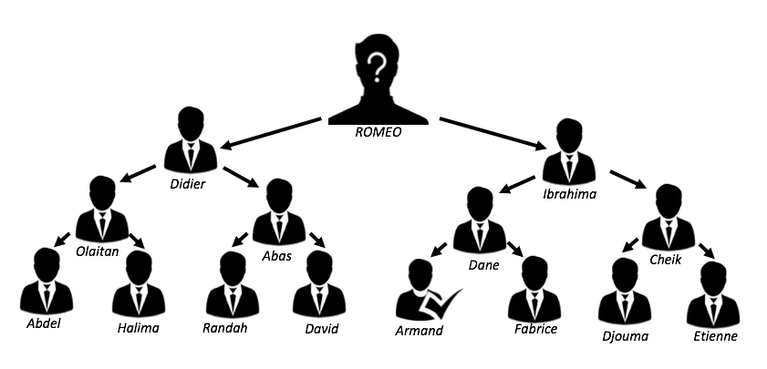

# 4.BFS

## Breadth-First Search

## :zero: Répertoire :page_facing_up:

* Creer son propre repertoire avec son :id: en ajoutant le fichier `README.md`

* Creer le code source dans le fichier `README.md`

## :one: L'Arbre :palm_tree:

    --Autheur Widby Armand--



* Ecrire l'arbre `graph = {}` de la page 106 en fonction des donnees ci-dessus 

## :two: Le vendeur

* Remplacer le code source de la page 108 avec celui ci-dessous

```Python
def person_is_seller(name):
    if (name == "Armand"):
        return True
    else :
        return False
```

## :three: La recherche

* Ecrire le source code de la recherche `search(name)` de page 107 à 110

## :four: Tester le code Python :snake: avec 

https://ide.geeksforgeeks.org/

```Python
search("Romeo")
```
